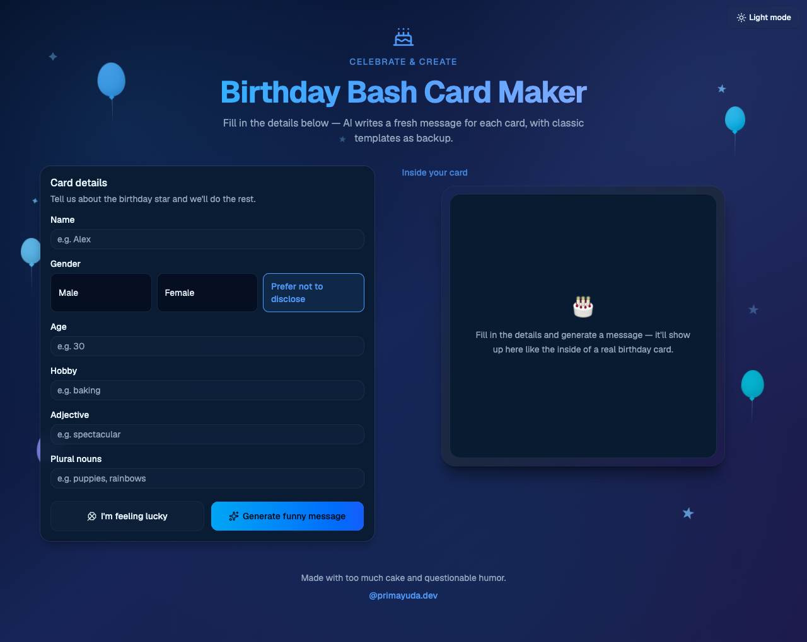

# Birthday Bash Card Maker

A funny birthday card message generator built with [Astro](https://astro.build), [React](https://react.dev), [Tailwind CSS](https://tailwindcss.com), and [shadcn/ui](https://ui.shadcn.com).

Fill in details about the birthday star — name, gender, age, hobby, adjective, and plural nouns — and get a personalized humorous message with a festive card preview. Copy plain text to paste anywhere.

## Links

| | URL |
| --- | --- |
| **Personal site** | [primayuda.dev](https://primayuda.dev) |
| **Web app (live)** | [primayuda.dev/birthday-card-generator/](https://primayuda.dev/birthday-card-generator/) |

The app is hosted on [primayuda.dev](https://primayuda.dev) at the `/birthday-card-generator/` path, deployed via Cloudflare Workers.

## Screenshots

| Laptop (1280×800) | Mobile (390×844) |
| --- | --- |
|  |  |

## Features

- **AI messages** — Workers AI writes a fresh funny message per card (template fallback)
- **I'm feeling lucky** — auto-fill the form with silly values
- **Gender-aware** — male, female, or prefer not to disclose
- **Card images** — random birthday photos from Unsplash (local fallback)
- **Stacked cards** — generate multiple cards; shuffle or copy each one

## Stack

- **Astro 7** — static site with React islands
- **Tailwind CSS v4** — styling
- **shadcn/ui** — Button, Card, Input, Label
- **Cloudflare Workers** — hosting, Workers AI, Unsplash proxy

## Development

```bash
npm install
npm run dev
```

Open [http://localhost:4321/birthday-card-generator/](http://localhost:4321/birthday-card-generator/).

In local dev, API calls proxy to production. Stop the server with `npm run dev:stop`.

## Build & deploy

```bash
npm run build
npm run preview
npm run deploy:all   # Cloudflare Workers (app + router)
```

## Add more shadcn components

```bash
npx shadcn@latest add [component-name]
```

## Session resume (Cursor)

Using Cursor on this project? See [`.cursor/SESSION.md`](.cursor/SESSION.md) for architecture, deployment, and how to pick up where you left off.

**No API keys or tokens are stored in this repository.** They are configured in Cloudflare Worker secrets and GitHub Actions (see SESSION.md for setup commands and secret names only).
